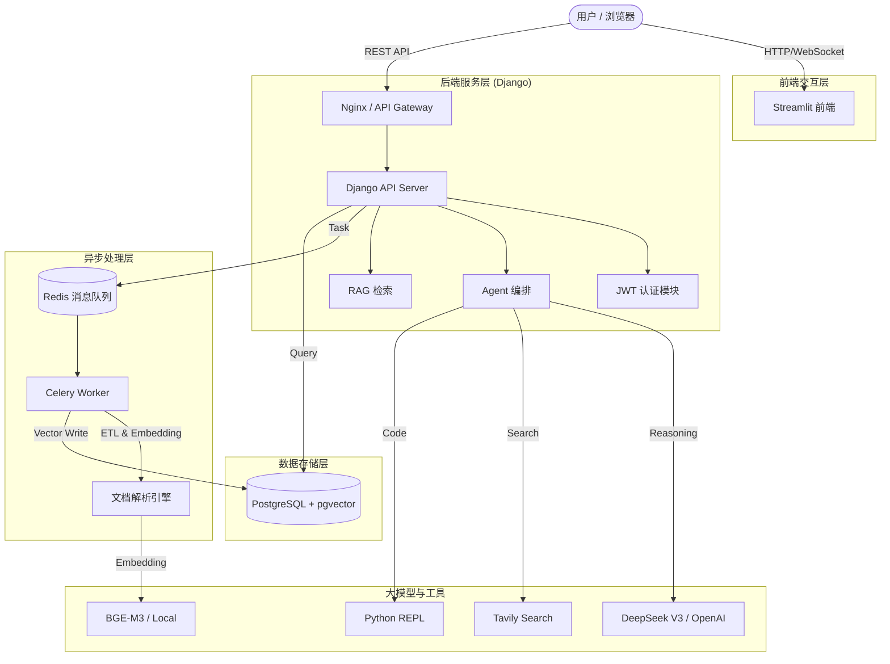

# 🚀 Nexus AI：一个新手从 0 实现的 RAG & Agent 学习项目

> 本项目是我在学习 **RAG（检索增强生成）** 和 **Agent（智能体）** 过程中，从零开始构建的实践项目，主要目标是**理解原理 +掌握工程化实现方式**，而不是追求完整的企业级功能。

项目使用 **Django + LangChain / LangGraph + Streamlit**，实现了一个可运行的知识库问答系统和多工具智能体原型。


## 📖 项目简介

**Nexus AI** 是一个面向学习与实验的 AI 项目，核心关注点包括：

- RAG 的完整流程（解析 → 向量化 → 检索 → 生成）
- 向量检索 + 关键词检索的混合策略
- 基于 LangGraph 的 Agent 推理流程编排
- Django 后端 + 异步任务的基础工程结构

> 本项目不追求“开箱即用的生产系统”，而是作为 **个人学习 RAG / Agent 架构的实验平台**。

---

## 🏗️ 系统架构




## ✨ 核心功能

### 🧠 1. 深度 RAG (检索增强生成)
*   **多格式解析**：支持 PDF、Word、Markdown、TXT，自动提取页码与元数据。
*   **混合检索 (Hybrid Search)**：结合 **向量检索** (Semantic) 与 **全文检索** (Keyword)，解决专有名词搜索难题。
*   **RRF 融合与重排序**：利用 `RRF` 算法融合多路召回结果，并使用 `BGE-Reranker` 进行精排
*   **多路查询 (Multi-Query)**：自动改写用户问题，从不同角度召回信息。
*   **全文摘要**：上传时自动生成文档摘要，支持宏观问题回答。

### 🕵️ 2. 全能智能体 (Agent)
*   基于 **LangGraph** 的流程式 Agent
*   **工具链集成**：
    *   🌐 **联网搜索**：集成 Tavily，获取实时信息。
    *   📚 **内网穿透**：Agent 可自主决定是否查询内部知识库。
    *   📊 **数据统计**：直接查询数据库统计信息。
    *   🐍 **代码解释器**：执行 Python 代码进行复杂计算与绘图。
*   **思维链可视化**：前端实时展示 "思考 -> 调用工具 -> 观察结果" 的完整过程。

### 🛡️ 3. 特性
*   **多租户隔离**：基于 JWT 的用户认证，确保数据权限严格隔离。
*   **异步流水线**：使用 Celery + Redis 处理大文件解析，不阻塞主线程。
*   **长期记忆**：基于向量库的用户画像系统，记住用户偏好。
*   **反馈闭环**：用户点赞/点踩系统，配合管理员数据看板。

---

## 🛠️ 技术栈

*   **后端**: Django 4.2, Django REST Framework
*   **前端**: Streamlit
*   **AI 编排**: LangChain, LangGraph
*   **数据库**: PostgreSQL 16 (pgvector, pg_trgm)
*   **缓存/队列**: Redis
*   **大模型**: DeepSeek V3 (LLM), BGE (Embedding/Rerank)

---

## 🚀 快速启动

### 1. 环境准备
确保本地已安装 `Python 3.10+`, `Docker` 和 `Git`。

```bash
# 克隆项目
git clone https://github.com/yourusername/nexus-ai.git
cd nexus-ai
```

### 2. 配置环境变量
复制模版并填入你的 API Key：

```bash
cp .env.example .env
# 编辑 .env 文件，填入 DEEPSEEK_API_KEY 和 TAVILY_API_KEY
```

### 3. 启动基础设施
使用 Docker 启动 PostgreSQL 和 Redis：

```bash
cd nexus_kb_backend
docker-compose up -d
```

### 4. 后端初始化
```bash
# 创建虚拟环境
python -m venv venv
source venv/bin/activate  # Windows: venv\Scripts\activate

# 安装依赖
pip install -r requirements.txt

# 数据库迁移
python manage.py migrate

# 下载本地模型 (Embedding & Reranker)
python download_model.py

# 创建管理员账号
python manage.py createsuperuser
```

### 5. 启动服务

**启动 Django API & Celery Worker:**
*(建议在两个终端分别运行)*

```bash
# Terminal 1
python manage.py runserver

# Terminal 2 (Windows)
celery -A config worker -l info --pool=solo
```

**启动 Streamlit 前端:**

```bash
cd ../frontend
streamlit run app.py
```

访问 `http://localhost:8501` 即可开始使用！

> 需要事先在admin后端创建数据库，才能使用文件上传功能

---

## 📂 目录结构

```text
nexus-ai/
├── nexus_kb_backend/       # Django 后端核心
│   ├── config/             # 项目配置
│   ├── core/               # 核心业务逻辑 (Agent, RAG, Views)
│   ├── local_models/       # 本地模型权重
│   └── docker-compose.yml  # 基础设施编排
├── frontend/               # Streamlit 前端
│   ├── app.py              # 入口文件
│   └── pages/              # 多页面逻辑
└── requirements.txt        # 依赖清单
```

## 📄 许可证
MIT License

